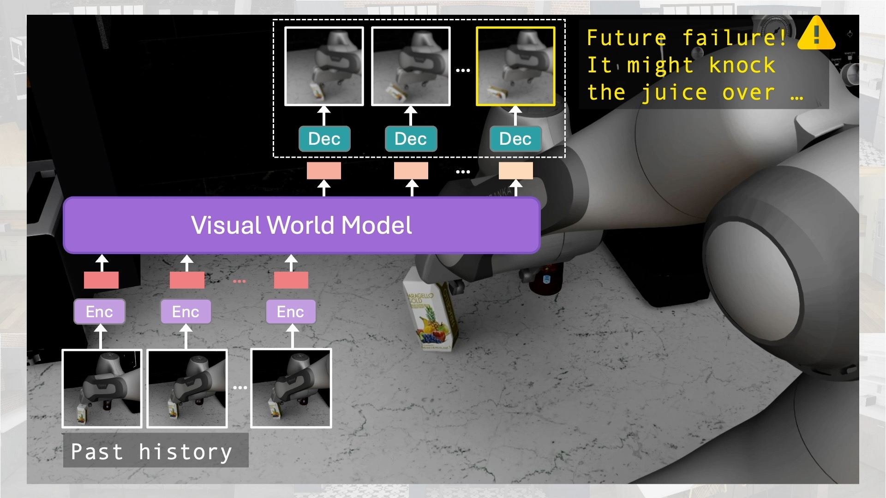

# Sirius-Fleet: Multi-Task Interactive Robot Fleet Learning with Visual World Models

<a href="https://ut-austin-rpl.github.io/sirius-fleet/" target="_blank"></a>

<br> [Huihan Liu](https://huihanl.github.io/), [Yu Zhang](https://www.linkedin.com/in/yu-zhang-b004a9290/?trk=contact-info), [Vaarij Betala](https://www.linkedin.com/in/vaarij-betala/), [Evan Zhang](https://www.linkedin.com/in/evan-zhang-81a9a9269/), [James Liu](https://www.linkedin.com/in/jamesshuangliu/), [Crystal Ding](https://www.linkedin.com/in/ding-crystal/), [Yuke Zhu](https://yukezhu.me/)
<br> [UT Austin Robot Perception and Learning Lab](https://rpl.cs.utexas.edu/)
<br> Conference on Robot Learning, 2024
<br> **[[Paper]](https://arxiv.org/abs/2410.22689)** &nbsp;**[[Project Website]](https://ut-austin-rpl.github.io/sirius-fleet/)**

This codebase is build off open-source codebase [robocasa](https://github.com/robocasa/robocasa) and [robomimic](https://github.com/ARISE-Initiative/robomimic). 

## Quickstart

### Setup Codebase 

#### Installing Sirius-Fleet

#### Installing robocasa

## Usage 

### Data Paths:

robocasa (simulation): [data]()

mutex (real robot): [data]()

### World Model Checkpoint Paths: 

robocasa (simulation): [checkpoint](https://utexas.box.com/s/8j3ktqg6ckig515n0479jcy4kfdydqqo)

mutex (real robot): [checkpoint](https://utexas.box.com/s/i4cw5q9ktq80sgpzcet4c4x4s0a6hmix)

### Loading pretrained checkpoints

```
python robomimic/scripts/load_policy_example.py robocasa.pth
```

### Running Sirius-Fleet


## Acknowledgements

This codebase is largely built off [robocasa](https://github.com/robocasa/robocasa), [robomimic](https://github.com/ARISE-Initiative/robomimic) and [robosuite](https://github.com/ARISE-Initiative/robosuite). 

For real-robot experiments, we used [Deoxys](https://ut-austin-rpl.github.io/deoxys-docs/html/getting_started/overview.html), a controller library for Franka Emika Panda developed by [Yifeng Zhu](https://zhuyifengzju.github.io/).

<br>